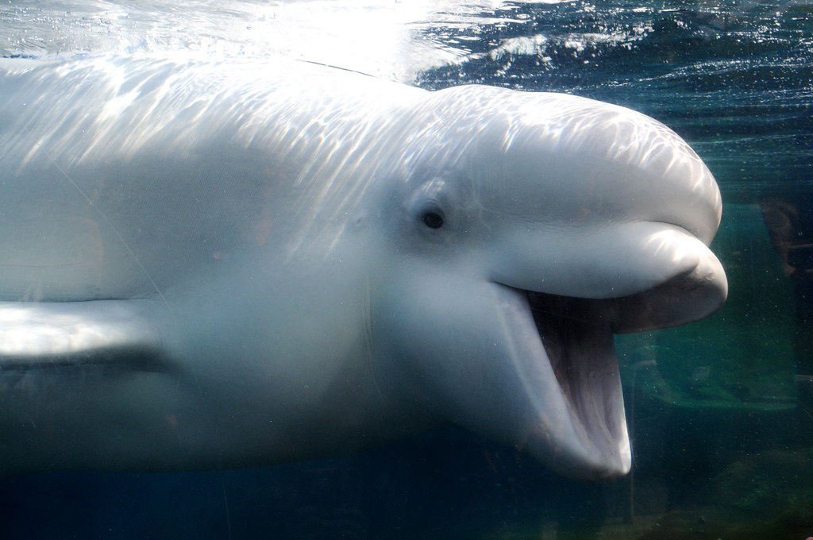

# EEB 622 - In Class Exercise - Beluga whale bioacoustics

This repository only contains the datasets required for the class activity. Please clone this repo to begin the activity and develop your own scripts based on the instructions in the prompt.

Instructions and background information can be found in this google drive folder:
https://drive.google.com/drive/folders/18qhex6PZW8Zwg0AgD6dD4xJgzg1MwOow

Happy analyzing!!

